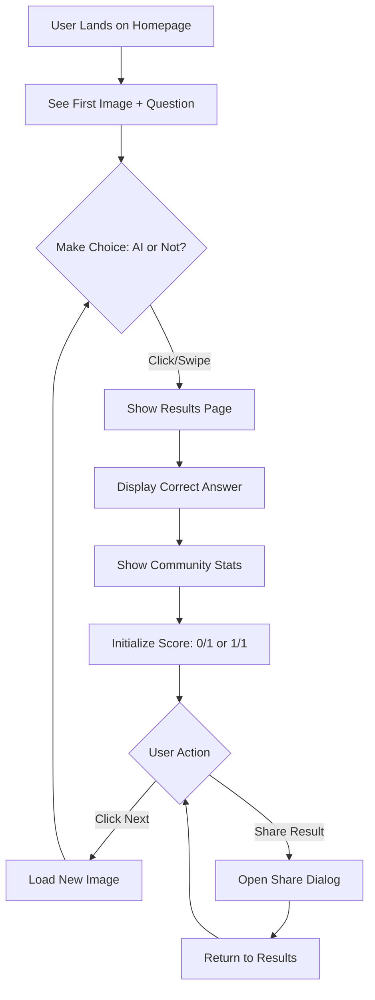
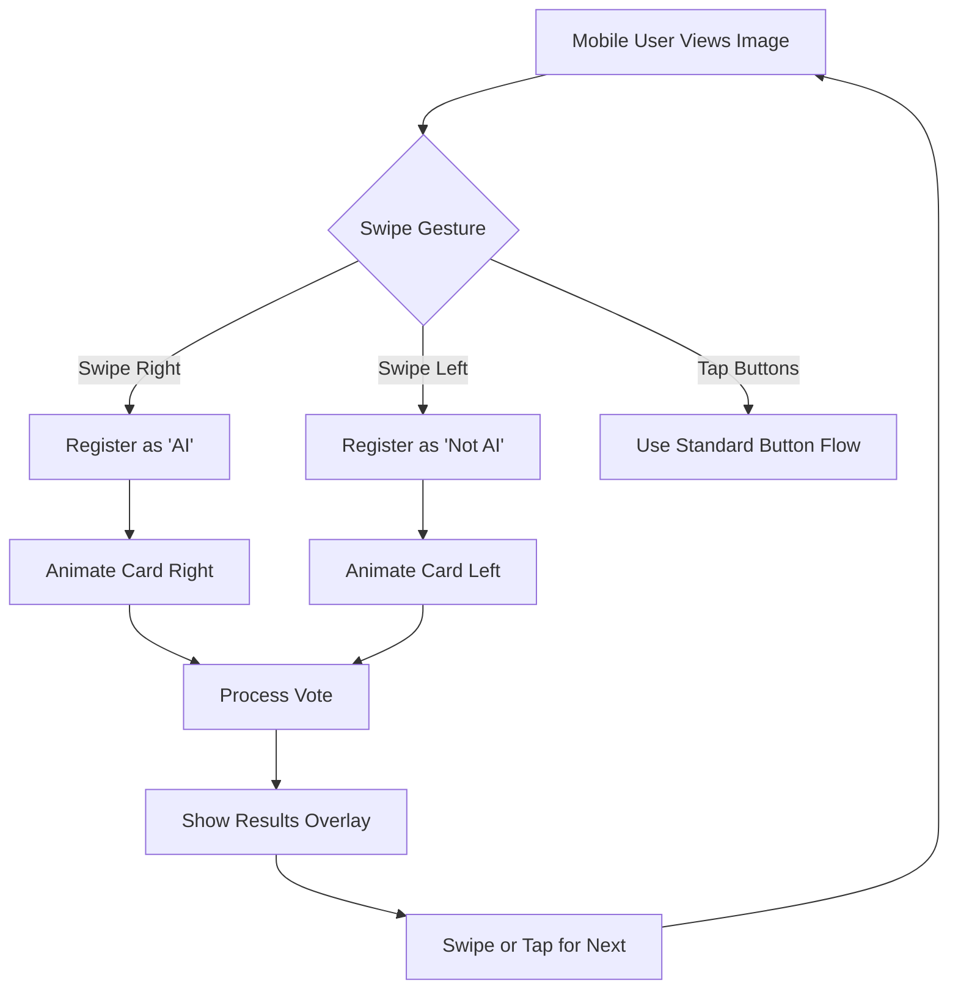
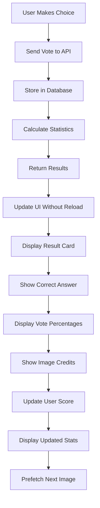

# AI or Not? - Complete Project Documentation

> A comprehensive guide containing all project documentation in a single file

---

# Table of Contents

1. [Product Requirements Document (PRD)](#product-requirements-document-prd)
2. [Technical Stack & Architecture](#technical-stack--architecture)
3. [User Stories](#user-stories)
4. [User Flows](#user-flows)
5. [API Research & Comparison](#api-research--comparison)

---

# Product Requirements Document (PRD)

## 1. Executive Summary

### Product Name: AI or Not? - The Ultimate Image Detection Game

### Vision Statement
Create an engaging, educational, and monetizable web game that challenges users to distinguish between AI-generated and real photographs, while building awareness about the advancing capabilities of AI image generation.

### Problem Statement
With the rapid advancement of AI image generation technology, it's becoming increasingly difficult to distinguish between real and AI-generated images. This creates both educational opportunities and potential risks for digital literacy.

### Solution
An interactive, gamified platform that:
- Tests users' ability to identify AI-generated images
- Provides immediate feedback and educational insights
- Tracks performance and creates competitive engagement through scoring
- Monetizes through strategic ad placement

## 2. Core Features & Functionality

### 2.1 Primary Game Loop
- **Image Display**: Large, centered image presentation
- **Binary Choice Interface**: Prominent "AI" and "Not AI" buttons
- **Instant Feedback**: Results page showing:
  - Correct answer
  - Community voting percentages
  - Total votes
  - Image source and credits
  - User's current score
  - Running statistics (correct/incorrect)
- **Continuous Play**: "Next" button to load new challenge without page reload

### 2.2 Gamification Elements
- **Persistent Scoring**: Track lifetime statistics using localStorage
- **Leaderboard**: Global rankings showing top performers
- **Streak Tracking**: Consecutive correct answers
- **Achievement System**: Milestones for accuracy and volume

### 2.3 Social Features
- **Share Results**: Social media integration for sharing individual results or achievements
- **Community Statistics**: Real-time voting data from all users

### 2.4 Mobile Experience
- **Responsive Design**: Optimized layouts for all screen sizes
- **Swipe Gestures**: Left swipe for "Not AI", Right swipe for "AI"
- **Touch-Optimized**: Large, thumb-friendly interaction areas

### 2.5 Monetization
- **Display Advertising**: 4 strategic banner placements
  - Top banner (728x90 leaderboard)
  - Bottom banner (728x90 leaderboard)
  - Left sidebar (160x600 skyscraper)
  - Right sidebar (160x600 skyscraper)
- **High-quality ad network integration** (Google AdSense recommended)

## 3. Technical Requirements

### 3.1 Performance
- Page load time < 2 seconds
- Image lazy loading with progressive enhancement
- Smooth transitions between game states
- No full page reloads during gameplay

### 3.2 Data Management
- Persistent storage of all voting data
- Real-time aggregation of community statistics
- Efficient caching strategy for images
- API rate limit management

### 3.3 Compatibility
- Modern browsers (Chrome, Firefox, Safari, Edge - last 2 versions)
- Mobile responsive (iOS Safari, Chrome Mobile)
- Progressive Web App capabilities

## 4. Success Metrics

### 4.1 Engagement Metrics
- **Daily Active Users (DAU)**
- **Average Session Duration** (target: >5 minutes)
- **Images Rated per Session** (target: >10)
- **Return User Rate** (target: >30%)

### 4.2 Monetization Metrics
- **Ad Revenue per User (ARPU)**
- **Click-Through Rate (CTR)**
- **Page Views per Session**

### 4.3 Quality Metrics
- **Accuracy Distribution** (bell curve centered ~60-70%)
- **User Satisfaction Score**
- **Social Share Rate**

---

# Technical Stack & Architecture

## Frontend Stack

### Core Framework
- **Framework**: Next.js 14 (App Router)
- **Language**: TypeScript
- **Runtime**: Node.js 18+

### Styling & UI
- **Styling**: Tailwind CSS
- **UI Components**: shadcn/ui
- **Animations**: Framer Motion
- **Icons**: Lucide React

### State Management
- **Phase 1**: React Context + useState/useReducer
- **Phase 2**: Redux Toolkit (when complexity increases)

### User Interaction
- **Gesture Detection**: react-swipeable
- **Social Sharing**: react-share
- **Image Handling**: next/image with optimization

## Backend Stack

### API Layer
- **API Routes**: Next.js API Routes
- **Validation**: Zod
- **Rate Limiting**: upstash/ratelimit

### Database
- **Primary Database**: PostgreSQL (via Supabase or PlanetScale)
- **ORM**: Prisma
- **Caching**: Redis (via Upstash)

### File Storage & CDN
- **Image CDN**: Cloudinary or Next.js Image Optimization
- **Static Assets**: Vercel Edge Network

## External Services

### Image Sources
#### Real Images
- **Primary**: Unsplash API
- **Secondary**: Pexels API
- **Tertiary**: Pixabay API

#### AI Images
- **Primary**: Replicate API (DALL-E, Stable Diffusion, Midjourney-style)
- **Secondary**: Leonardo.ai API
- **Experimental**: Hugging Face API

### Analytics & Monitoring
- **Analytics**: Vercel Analytics
- **Error Tracking**: Sentry
- **Performance Monitoring**: Web Vitals

### Monetization
- **Primary Ad Network**: Google AdSense
- **Backup Ad Network**: Media.net
- **Ad Management**: Custom React components with lazy loading

## Infrastructure

### Hosting & Deployment
- **Platform**: Vercel (optimized for Next.js)
- **CDN**: Vercel Edge Network
- **Domain & DNS**: Cloudflare

## Architecture Patterns

### Application Architecture
```
┌─────────────────────────────────────────────────────────┐
│                     Client Browser                       │
│  ┌─────────────────────────────────────────────────┐   │
│  │            Next.js React Application             │   │
│  │  ┌───────────┐  ┌──────────┐  ┌──────────┐    │   │
│  │  │   Pages   │  │Components│  │   Hooks   │    │   │
│  │  └───────────┘  └──────────┘  └──────────┘    │   │
│  └─────────────────────────────────────────────────┘   │
└─────────────────────────────────────────────────────────┘
                           │
                           ▼
┌─────────────────────────────────────────────────────────┐
│                   Next.js API Routes                     │
│  ┌──────────┐  ┌──────────┐  ┌──────────────────┐     │
│  │   Auth   │  │   Game   │  │   Image Service   │     │
│  └──────────┘  └──────────┘  └──────────────────┘     │
└─────────────────────────────────────────────────────────┘
                           │
                           ▼
┌─────────────────────────────────────────────────────────┐
│                    Data Layer                            │
│  ┌──────────┐  ┌──────────┐  ┌──────────────────┐     │
│  │PostgreSQL│  │  Redis   │  │  External APIs   │     │
│  └──────────┘  └──────────┘  └──────────────────┘     │
└─────────────────────────────────────────────────────────┘
```

### Caching Strategy

| Content Type | Cache Duration | Cache Location |
|-------------|---------------|----------------|
| Image Metadata | 24 hours | Redis + Browser |
| Vote Statistics | 5 minutes | Redis |
| Leaderboard | 15 minutes | Redis |
| Static Assets | Permanent | CDN + Browser |
| API Responses | Variable | Redis + HTTP Cache |

## Performance Targets

### Core Web Vitals
- **LCP** (Largest Contentful Paint): < 2.5s
- **FID** (First Input Delay): < 100ms
- **CLS** (Cumulative Layout Shift): < 0.1

### Application Metrics
- **Time to Interactive**: < 3s
- **Image Load Time**: < 1s (with lazy loading)
- **API Response Time**: < 200ms (p95)
- **Database Query Time**: < 50ms (p95)

---

# User Stories

## Epic 1: Core Gameplay

### US-1.1: Image Display
**As a** player
**I want to** see a large, clear image
**So that** I can examine it for AI characteristics

**Acceptance Criteria:**
- Image displays at minimum 600x600px on desktop
- Image scales responsively on mobile
- Loading indicator shows while image loads
- Images are high-resolution and clear
- Proper aspect ratio is maintained

### US-1.2: Making Choices
**As a** player
**I want to** make my choice using obvious buttons
**So that** I can easily indicate my decision

**Acceptance Criteria:**
- Two large, contrasting buttons labeled "AI" and "Not AI"
- Buttons have hover states and click feedback
- Buttons are thumb-reachable on mobile
- Clear visual hierarchy with the question "Is this photo AI?"
- Buttons are disabled during loading/processing

### US-1.3: Immediate Feedback
**As a** player
**I want to** see if I was correct immediately
**So that** I can learn from my mistakes

**Acceptance Criteria:**
- Result displays within 500ms of selection
- Clear indication of correct/incorrect (green/red)
- Explanation or hint about why it's AI or real
- No page reload during transition
- Smooth animation between states

## Epic 2: Progress & Scoring

### US-2.1: Persistent Progress
**As a** player
**I want** my score to persist across sessions
**So that** I can track improvement

**Acceptance Criteria:**
- Score saves to localStorage
- Display current streak
- Show total games played
- Calculate and display accuracy percentage
- Handle browser storage limits gracefully

### US-2.2: Competitive Leaderboard
**As a** player
**I want to** see my ranking on a leaderboard
**So that** I can compete with others

**Acceptance Criteria:**
- Global leaderboard showing top 100 players
- Display username, score, and accuracy
- Highlight current user's position
- Update every 15 minutes
- Handle tie-breaking rules

## Epic 3: Mobile Experience

### US-3.1: Swipe Gestures
**As a** mobile user
**I want to** swipe to make choices
**So that** the interaction feels natural

**Acceptance Criteria:**
- Right swipe = "AI", Left swipe = "Not AI"
- Visual feedback during swipe
- Swipe threshold prevents accidental choices
- Option to use buttons if preferred

## Epic 4: Social Features

### US-4.1: Social Sharing
**As a** player
**I want to** share my results on social media
**So that** I can challenge friends

**Acceptance Criteria:**
- Share buttons for Twitter/X, Facebook, LinkedIn
- Pre-populated text with score and link
- Custom Open Graph image for shares
- Track share analytics

---

# User Flows

## Flow 1: First-Time User Journey



## Flow 2: Mobile Swipe Interaction



## Flow 3: Results and Statistics Display



---

# API Research & Comparison

## Real Photography APIs

### 1. Unsplash API ⭐ PRIMARY RECOMMENDATION

**Overview**: Premium quality, professionally curated stock photography platform.

#### Pros
- Completely free with generous rate limits (50 requests/hour)
- High-quality, curated images with consistent standards
- Detailed metadata including photographer info, camera settings
- Excellent documentation and developer support
- Large, diverse library (3M+ images)
- Easy-to-use REST API

#### Cons
- Requires attribution (can be done programmatically)
- Limited to photography (no AI images)
- Rate limits may require caching strategy

#### Best For
High-quality real photos with professional standards

### 2. Pexels API ⭐ SECONDARY RECOMMENDATION

**Overview**: Free stock photo platform with good variety and no attribution required.

#### Pros
- Free with 200 requests/hour (higher than Unsplash)
- No attribution required (though appreciated)
- Good variety of images and styles
- Video content also available
- Simple API structure
- Multiple image sizes provided

#### Cons
- Smaller library than Unsplash (3.2M photos)
- Less detailed metadata
- Quality can be more variable

#### Best For
Secondary source for variety and backup when rate limited

## AI Image Generation APIs

### 1. Replicate API ⭐ PRIMARY RECOMMENDATION

**Overview**: Unified platform for accessing multiple AI models including Stable Diffusion, DALL-E style models, and more.

#### Pros
- Access to multiple AI models through single API
- Pay-per-use pricing (very affordable ~$0.0002/image)
- Can use existing AI images from their gallery
- Excellent documentation and examples
- Supports both generation and retrieval
- Wide variety of AI styles and models

#### Cons
- Requires payment (but very cheap for this use case)
- Need to manage model selection

#### Pricing
- ~$0.0002 per image
- ~$60/month for 300,000 image serves

#### Best For
Primary AI image source with maximum variety

### 2. Leonardo.ai API

**Overview**: High-quality AI image generation platform with multiple models.

#### Pros
- High-quality AI images
- Free tier available (150 tokens/month)
- Multiple AI models and styles
- Good documentation
- Consistent quality

#### Cons
- Limited free tier (only ~150 images/month)
- More complex API structure
- Requires more setup

#### Best For
Premium AI images for special cases

## Recommended Implementation Strategy

### Image Distribution Strategy
- 50% Real images (Unsplash/Pexels)
- 50% AI images with variety:
  - 20% DALL-E style (via Replicate)
  - 20% Stable Diffusion (via Replicate)
  - 5% Midjourney style (via Replicate)
  - 5% Leonardo.ai

### Cost Analysis

Monthly Cost Estimation (1000 DAU):
- **Unsplash**: Free (with attribution)
- **Pexels**: Free
- **Replicate**: ~$60/month (300,000 image serves)
- **Leonardo.ai**: Free tier sufficient for variety
- **Total**: ~$60-80/month

---

*This document combines all essential project documentation for the AI or Not? game. For implementation details, refer to the PHASE1_IMPLEMENTATION_BRIEF.md file.*