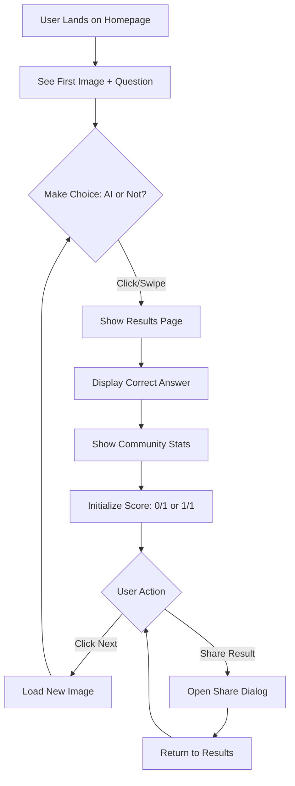
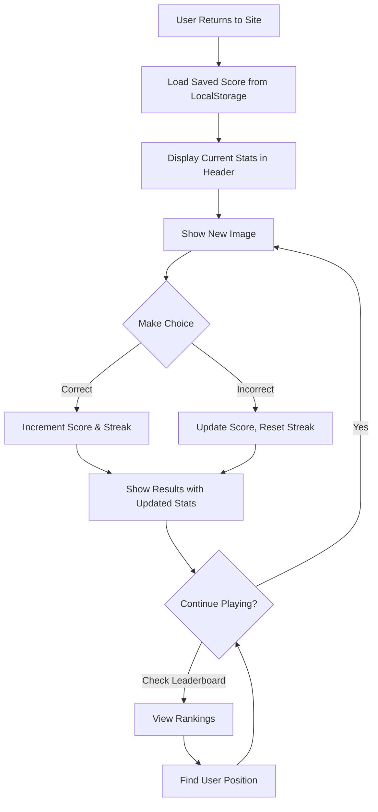
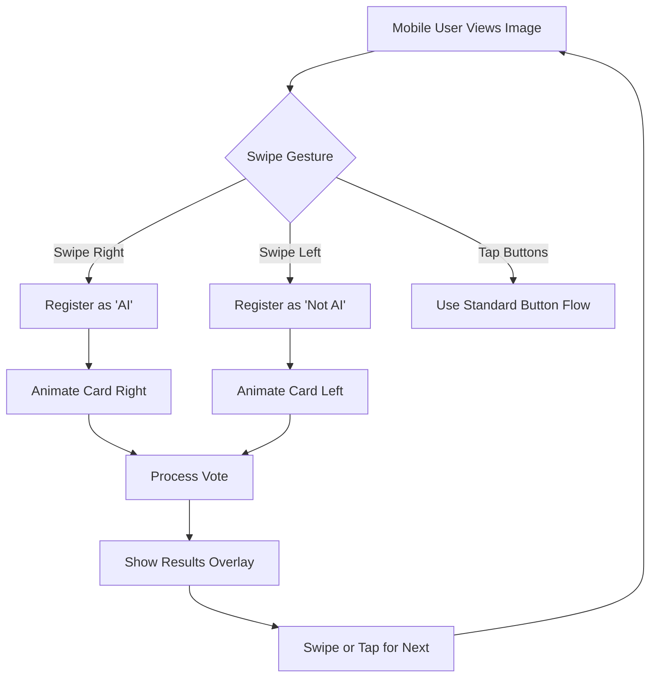
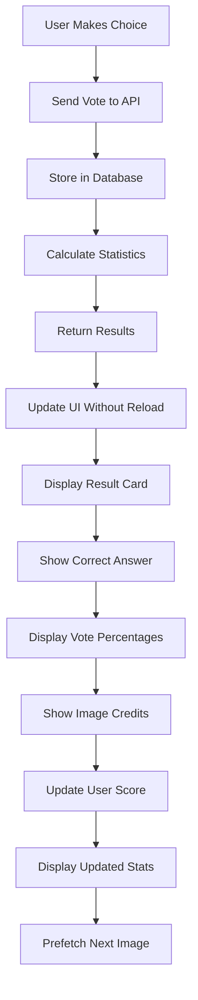
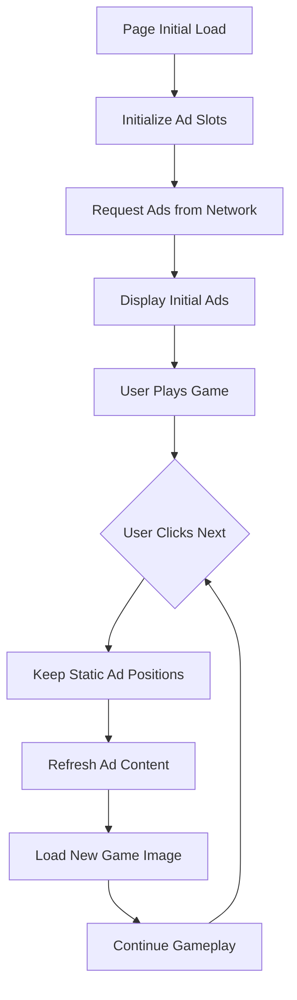
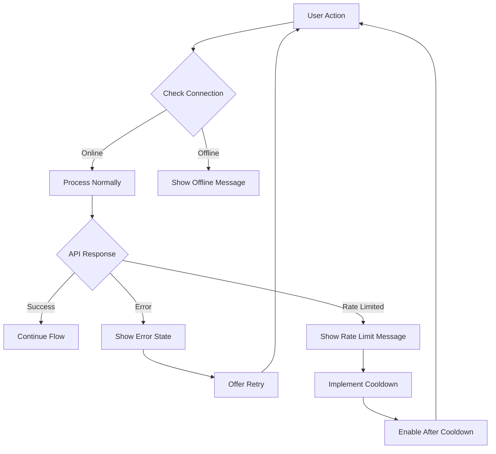
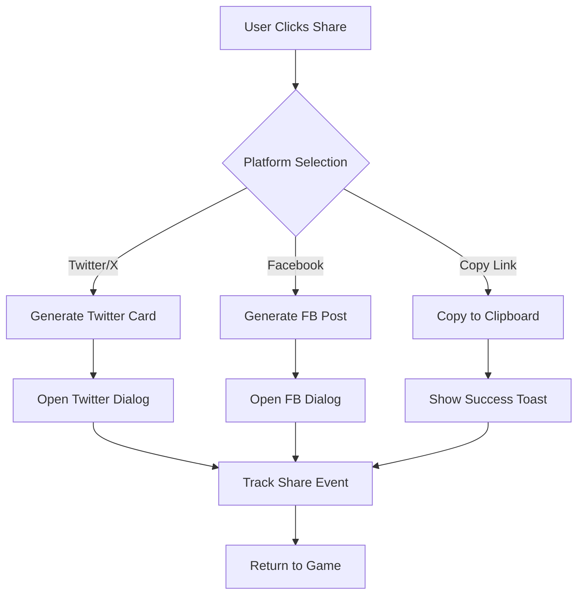
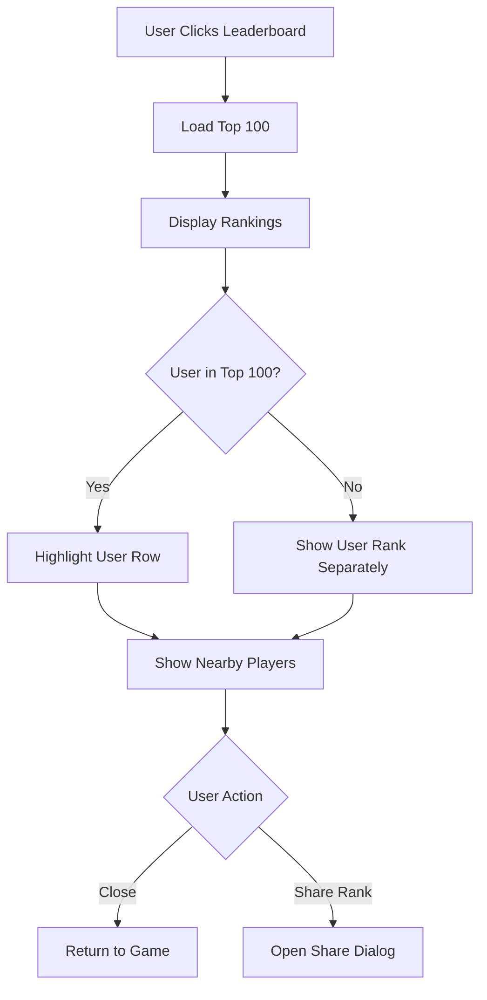
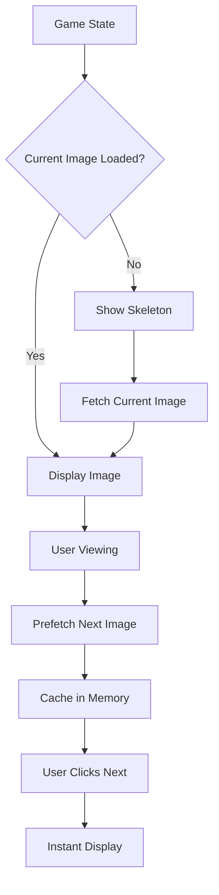
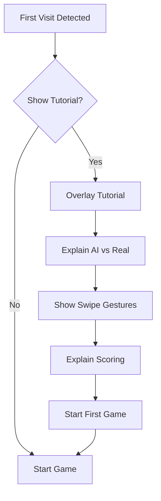

# User Flows

## Flow 1: First-Time User Journey



### Description
This flow represents a new user's first interaction with the platform. They immediately see an image and must make a decision. After choosing, they see the results, community statistics, and their initial score. The flow emphasizes immediate engagement without registration barriers.

### Key Decision Points
- Initial choice: AI or Not AI
- Post-result action: Continue playing or share

### Success Metrics
- Time to first interaction: <5 seconds
- First session completion rate: >80%
- Share rate for first-time users: >3%

---

## Flow 2: Returning User Experience



### Description
Returning users have their progress automatically loaded from localStorage. Their current statistics are visible, creating continuity between sessions. The leaderboard provides competitive motivation.

### Key Features
- Automatic score restoration
- Visible progress indicators
- Seamless continuation of gameplay
- Access to competitive features

### Success Metrics
- Returning user rate: >30%
- Average session length increase: >20%
- Leaderboard engagement: >15%

---

## Flow 3: Mobile Swipe Interaction



### Description
Mobile users can interact through intuitive swipe gestures similar to dating apps. The flow includes visual feedback through card animations and maintains the option for traditional button interaction.

### Gesture Mapping
- **Right Swipe**: AI-generated image
- **Left Swipe**: Real photograph
- **Tap**: Use traditional buttons

### Mobile Optimization
- Touch target size: minimum 44x44px
- Swipe sensitivity: 30% of screen width
- Animation duration: 300ms
- Haptic feedback on supported devices

---

## Flow 4: Results and Statistics Display



### Description
This flow details the backend processing and frontend updates that occur after a user makes their choice. The system processes the vote, updates statistics, and prepares for the next round while showing results.

### Technical Details
- API response time: <200ms
- Database write: Asynchronous
- Statistics calculation: Real-time aggregation
- UI update: No page reload
- Next image prefetch: During result display

### Information Displayed
1. Correct/Incorrect indicator
2. Community voting percentages
3. Total number of votes
4. Image source and credits
5. Updated personal score
6. Current streak status

---

## Flow 5: Ad Display Lifecycle



### Description
Advertisement display and refresh cycle that maintains user experience while maximizing ad revenue. Ads refresh with new game rounds but positions remain static to prevent layout shift.

### Ad Placement Strategy
- **Desktop**: 4 banner positions (top, bottom, left, right)
- **Mobile**: 2 positions (top and bottom only)
- **Refresh Rate**: On "Next" button click
- **Load Priority**: Async, non-blocking

### Performance Considerations
- Lazy loading for below-fold ads
- Fallback for ad blocker users
- No impact on Core Web Vitals
- Graceful degradation

---

## Flow 6: Error Handling States



### Description
Comprehensive error handling ensures users can recover from various failure scenarios without losing progress or leaving the platform.

### Error Types & Responses

| Error Type | User Message | Recovery Action |
|------------|--------------|-----------------|
| Network Offline | "No internet connection" | Enable offline mode |
| API Error | "Something went wrong" | Retry button |
| Rate Limited | "Too many requests" | Cooldown timer |
| Image Load Failed | "Image unavailable" | Skip to next |
| Database Error | "Score save failed" | Queue for retry |

### Offline Mode Features
- Cache last 10 images
- Store votes locally
- Sync when reconnected
- Limited functionality indicator

---

## Flow 7: Social Sharing Flow



### Description
Social sharing flow allows users to share their results or specific interesting images with their networks, driving viral growth.

### Share Content Templates

**Score Share**:
```
I just scored 8/10 on AI or Not!
Can you beat my score at detecting AI images?
🤖 vs 📸
[link]
```

**Image Share**:
```
82% of people thought this was AI, but it's real!
Test your AI detection skills:
[link]
```

### Technical Implementation
- Open Graph meta tags
- Twitter Card support
- Native share API on mobile
- Clipboard fallback
- Analytics tracking

---

## Flow 8: Leaderboard Interaction



### Description
Leaderboard provides competitive element and social proof, encouraging continued engagement and improvement.

### Leaderboard Features
- Global top 100 display
- User's rank highlighted
- Nearby competitors shown
- Refresh every 15 minutes
- Share ranking capability

### Ranking Algorithm
```
Score = (Correct Answers * 100) + (Accuracy % * 10) + (Streak Bonus * 5)
```

---

## Flow 9: Image Loading & Prefetch



### Description
Optimized image loading strategy ensures smooth gameplay with no waiting between rounds.

### Loading Strategy
1. **Priority Loading**: Current image first
2. **Prefetching**: Next image during result viewing
3. **Caching**: Keep last 5 images in memory
4. **Progressive Enhancement**: Show low-res first, then high-res
5. **Fallback**: Generic placeholder if load fails

### Performance Targets
- Initial image load: <1 second
- Subsequent images: Instant (prefetched)
- Skeleton display: Immediate
- Error handling: Automatic retry with exponential backoff

---

## Flow 10: Tutorial for New Users



### Description
Optional tutorial for first-time users to understand game mechanics and improve engagement.

### Tutorial Steps
1. **Welcome**: Brief explanation of the game
2. **How to Play**: Show AI vs Real examples
3. **Controls**: Demonstrate swipe gestures (mobile) or buttons
4. **Scoring**: Explain points and streaks
5. **Start Playing**: Jump into first image

### Skip Options
- "Skip Tutorial" button always visible
- Auto-dismiss after 30 seconds
- Don't show again checkbox
- Accessible from help menu later